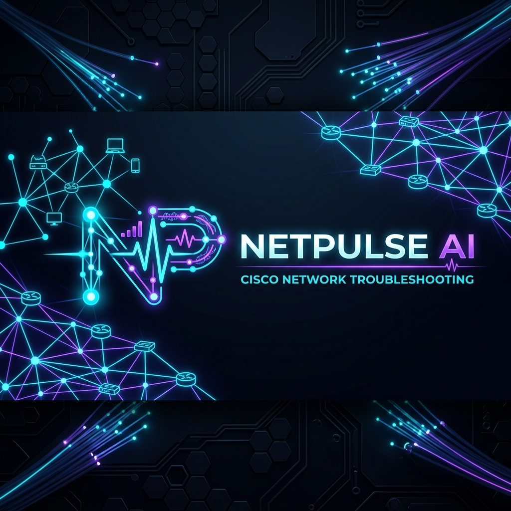

<div align="center">

# NetPulse AI



### Next-Gen Cisco Network Intelligence & AI Diagnostic Engine

<p>
  Automated Cisco Packet Tracer fault diagnostics, telemetry analysis, deterministic rule verification, dynamic risk scoring, and human-in-the-loop audit streaming powered by <b>Python 3.11+</b>, <b>FastAPI</b>, and <b>LLMs</b>.
</p>

<p>
  <a href="backend/docs/ARCHITECTURE.md">ARCHITECTURE</a>
  ·
  <a href="backend/docs/API_REFERENCE.md">API REFERENCE</a>
  ·
  <a href="backend/docs/VSCODE_SETUP.md">QUICK START</a>
  ·
  <a href="backend/docs/TESTING.md">EVALUATION</a>
  ·
  <a href="backend/docs/TROUBLESHOOTING.md">TROUBLESHOOTING</a>
</p>

<p>
  
  
  
  
  
  
</p>

</div>

---

> **NetPulse AI** is a state-of-the-art diagnostic workbench built for network engineers. It analyzes CLI outputs, ping results, interface configs, trunking logs, OSPF adjacency states, and port-security violations to deliver instant root-cause identification, Cisco IOS remediation commands, risk scoring, and blast radius calculations.

---

## 🚀 Quick Start

```bash
# 1. Navigate to backend directory
cd backend

# 2. Setup virtual environment & dependencies
python -m venv .venv
.venv\Scripts\activate
pip install -r requirements.txt

# 3. Configure API key
cp .env.example .env  # Add OPENROUTER_API_KEY

# 4. Start NetPulse AI Telemetry Server (FastAPI + Cyber UI)
python main.py        # Server running at http://localhost:8000

# 5. Execute CLI Diagnostic Tool
python main_cli.py

# 6. Run automated test suite
venv\Scripts\python.exe -m pytest tests/ -v
```

---

## 📁 System Architecture & Directory Layout

```
NetPulse-AI/
├── backend/                    # Core Telemetry Engine & API
│   ├── main.py                 # FastAPI Web Server (port 8000)
│   ├── main_cli.py             # Telemetry CLI Terminal Mode
│   ├── requirements.txt
│   ├── data/                   # 32 Cisco Packet Tracer Scenarios & Log Storage
│   ├── docs/                   # Full Technical & Architectural Specs
│   ├── scripts/                # Integration & Validation Scripts
│   ├── src/                    # Telemetry Core Modules
│   │   ├── config.py           # Environment & LLM Configurations
│   │   ├── models.py           # Case, DiagnosisResult, Risk Score Pydantic Schemas
│   │   ├── data_loader.py      # Telemetry Dataset Reader
│   │   ├── evidence_parser.py  # CLI & Output Log Parser
│   │   ├── rule_checker.py     # 10 Phase-1 Deterministic Rule Validators
│   │   ├── diagnosis.py        # AI Reasoning Engine & Risk Calculator
│   │   ├── llm_client.py       # OpenRouter & Fallback LLM Connectors
│   │   ├── human_review.py     # Engineer Verification Logger
│   │   └── dashboard.py        # Telemetry Analytics & Metrics
│   └── tests/                  # Pytest Unit & Integration Tests
├── frontend/                   # Dark Cybernetic UI System
│   ├── static/
│   │   ├── css/style.css       # Obsidian & Glassmorphism Styling System
│   │   └── js/main.js          # NetPulse Global Utility & Toast Engine
│   └── templates/              # Jinja2 Cyber Interfaces
│       ├── base.html           # Glassmorphic Navbar & Footer Layout
│       ├── index.html          # Telemetry Overview Dashboard
│       ├── diagnose.html       # AI Incident Diagnostic Workbench
│       ├── cases.html          # Known Fault Matrix & Multi-Filter
│       ├── dashboard.html      # Performance Analytics & Charts
│       └── review.html         # Human Engineer Verification Audit
```

---

## 🔥 Key Platform Capabilities

| Capability | Technical Description |
|------------|-----------------------|
| **32 Cisco Fault Models** | Covers Layer 2/3 IP Subnetting, 802.1Q Trunking, Inter-VLAN Routing, DHCP, OSPF Dead Timers, Port Security, ACL, NAT, and WLC |
| **Phase-1 Rule Engine** | 10 deterministic checks run automatically to catch static IP/VLAN/Gateway misconfigurations prior to LLM inference |
| **Multi-Stage AI Pipeline** | Telemetry parsing → Rule verification → Concept filtering → LLM reasoning → Enforced JSON payload |
| **Risk & Impact Calculator** | Dynamically calculates incident risk score (0-100) and blast radius scope (Local Host, VLAN Scope, Router Subnet) |
| **Human-in-the-Loop Audit** | Formally logs engineer verification (*Accepted*, *Edited*, or *Rejected*) into `human_review_log.md` |
| **Cyber Glassmorphic UI** | Premium dark-mode dashboard with real-time websocket broadcast, live status badges, and Chart.js telemetry |

---

## 🔌 Core API Reference (`main.py`)

| Endpoint | Method | Function |
|----------|--------|----------|
| `/` | GET | NetPulse Telemetry Overview Page |
| `/diagnose` | GET | AI Incident Diagnostic Console Page |
| `/cases` | GET | Fault Category Matrix Page |
| `/dashboard` | GET | System Performance Analytics Page |
| `/review` | GET | Human Verification Audit Page |
| `/api/health` | GET | Engine Status & Diagnostic Model Telemetry |
| `/api/system/metrics` | GET | Real-Time System Metrics & Latency |
| `/api/cases/search` | GET | Multi-Parameter Query (Q, Concept, Severity, OSI) |
| `/api/cases` | GET | Retrieve List of 32 Pre-Configured Scenarios |
| `/api/cases/{id}` | GET | Fetch Specific Case Details & Telemetry Logs |
| `/api/diagnose` | POST | Execute Phase-1 Rules & AI Root-Cause Analysis |
| `/api/rule-check` | POST | Run Standalone Deterministic Checks |
| `/api/review` | POST | Log Engineer Verification Decision & Correction |
| `/api/dashboard/data` | GET | Fetch Chart.js Analytics & Summary Aggregates |
| `/ws` | WS | Real-Time Incident Broadcast Channel |

---

## ⚡ Telemetry Input Format Example

```text
[user_description]
PC1 cannot ping PC2. Both are connected to switch SW1.

[ping_results]
Pinging 192.168.1.20 with 32 bytes of data:
Request timed out (100% loss).

[ipconfig]
IPv4 Address: 192.168.2.10
Subnet Mask: 255.255.255.0
Default Gateway: 192.168.1.1

[show_running_config]
interface FastEthernet0/1
 switchport mode access
 switchport access vlan 10
```

---

## 🛡️ Responsible AI & Verification Workflow

1. Every diagnostic result includes a **Confidence Score**, **Risk Score**, and **Impact Assessment**.
2. Network engineers audit each diagnosis using the **Human Verification Form**.
3. Corrections update system precision metrics and persist to the audit log.

---

## 📄 License

Educational & Engineering Research Project for Cisco Network Troubleshooting & AI Integration.

**Platform:** NetPulse AI Diagnostics v2.5  
**Safety Requirement:** Human audit verification enabled for all remediation command recommendations.
